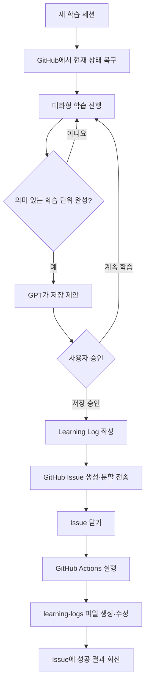
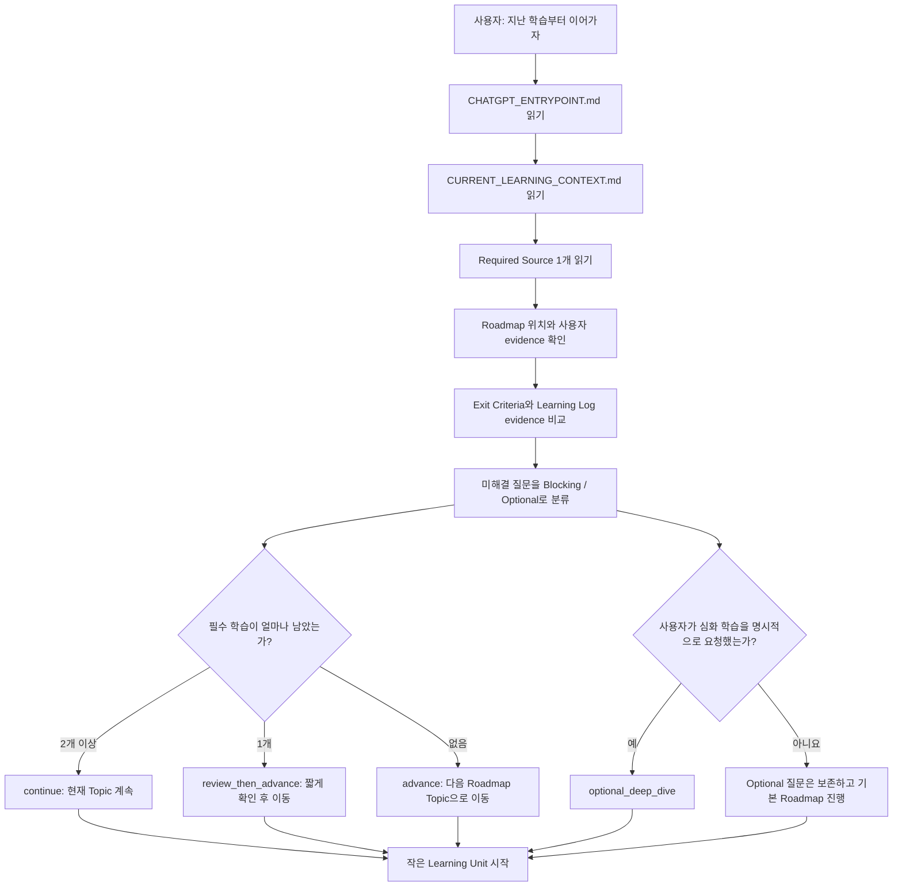

현재 시스템은 **학습 내용 저장 파이프라인까지 정상 작동하는 v0.2 계열**이라고 볼 수 있습니다.

Learning Log 저장, Paper Reading Checkpoint 저장과 승인된 Current Boundary 갱신은 자동화되어 있습니다. 다만 어느 boundary로 이동할지와 무엇을 별도 선수지식 학습으로 남길지는 ChatGPT가 임의로 정하지 않고 사용자가 선택합니다.

## 전체 구조



## 1. 각 GitHub 파일의 역할

| 파일 또는 경로                                                                                                                                                 | 역할                                |
| -------------------------------------------------------------------------------------------------------------------------------------------------------- | --------------------------------- |
| [`system/CHATGPT_ENTRYPOINT.md`](https://github.com/thisisjskim/ai-semiconductor-study/blob/main/system/CHATGPT_ENTRYPOINT.md)                           | 일반 ChatGPT의 학습 session 시작점          |
| [`state/CURRENT_LEARNING_CONTEXT.md`](https://github.com/thisisjskim/ai-semiconductor-study/blob/main/state/CURRENT_LEARNING_CONTEXT.md)                 | 최소 읽기로 현재 위치를 복구하는 snapshot       |
| [`system/RESEARCH_OS.md`](https://github.com/thisisjskim/ai-semiconductor-study/blob/main/system/RESEARCH_OS.md)                                         | 학습·기록·승인 정책의 canonical source       |
| [`roadmap/ROADMAP.md`](https://github.com/thisisjskim/ai-semiconductor-study/blob/main/roadmap/ROADMAP.md)                                               | 장기 학습 방향과 단계                      |
| [`roadmap/LEARNING_BOUNDARIES.json`](https://github.com/thisisjskim/ai-semiconductor-study/blob/main/roadmap/LEARNING_BOUNDARIES.json)                   | topic별 최소 이해·exit criteria·다음 topic 계약 |
| [`roadmap/PROGRESS.md`](https://github.com/thisisjskim/ai-semiconductor-study/blob/main/roadmap/PROGRESS.md)                                             | 승인된 Current Boundary와 사람이 참고하는 장기 계획·현황 |
| [`system/LEARNING_LOG_ISSUE_CONTRACT.md`](https://github.com/thisisjskim/ai-semiconductor-study/blob/main/system/LEARNING_LOG_ISSUE_CONTRACT.md)         | 일반 ChatGPT의 Learning Log 저장 계약      |
| [`system/PAPER_NOTE_ISSUE_CONTRACT.md`](https://github.com/thisisjskim/ai-semiconductor-study/blob/main/system/PAPER_NOTE_ISSUE_CONTRACT.md)             | Paper Reading Checkpoint 저장 계약          |
| [`templates/learning-log.md`](https://github.com/thisisjskim/ai-semiconductor-study/blob/main/templates/learning-log.md)                                 | Learning Log 문서 형식                |
| [`templates/paper-note.md`](https://github.com/thisisjskim/ai-semiconductor-study/blob/main/templates/paper-note.md)                                     | living Paper Note 문서 형식            |
| `learning-logs/YYYY/MM/*.md`                                                                                                                             | 실제 학습 과정과 이해 증거가 쌓이는 곳            |
| `paper-notes/{foundational\|ssl-lab\|related}/*.md`                                                                                                     | 논문 분석, Resume Point와 Bridge가 쌓이는 곳     |
| [`.github/workflows/learning-log-ingest.yml`](https://github.com/thisisjskim/ai-semiconductor-study/blob/main/.github/workflows/learning-log-ingest.yml) | Issue 내용을 실제 Markdown 파일로 바꾸는 자동화 |
| [`.github/workflows/paper-note-ingest.yml`](https://github.com/thisisjskim/ai-semiconductor-study/blob/main/.github/workflows/paper-note-ingest.yml)     | 승인된 Paper Note 한 파일을 검증·갱신하는 자동화 |

핵심적으로 GitHub에는 네 종류의 정보가 있습니다.

* `ROADMAP.md`: 어디로 갈 것인가
* `PROGRESS.md`: 현재 어디에 있는가
* `learning-logs/**`: 왜 그 위치에 있다고 판단할 수 있는가
* `paper-notes/**`: 어떤 논문을 어디까지 읽었고 어느 선수지식에서 멈췄는가

즉, Learning Log가 실제 학습의 증거이고 `PROGRESS.md`는 사용자가 승인한 공식 학습 위치만 가리킵니다. 최신 Log의 주제가 달라져도 Current Boundary는 자동으로 이동하지 않습니다.

---

## 2. 새 채팅에서 학습을 이어가는 방식

새로운 일반 ChatGPT 채팅에서는 이전 대화를 기억한다고 가정하지 않고 GitHub에서 현재 상태를 복구합니다. 기본 bootstrap은 두 파일입니다.

```text
system/CHATGPT_ENTRYPOINT.md
→ state/CURRENT_LEARNING_CONTEXT.md
```

entrypoint는 Tutor Loop, Learning Unit과 checkpoint를 알려 주고, context snapshot은 Roadmap Position과 `Current Paper Note` 경로를 제공합니다. Current Paper가 있으면 해당 Paper Note의 Resume Point와 Prerequisite Bridge를 먼저 읽습니다. 일반 학습이라면 snapshot이 지정한 Learning Log와 boundary를 읽고 사용자의 실제 설명 수준에 맞춰 작은 학습 단위를 시작합니다.

아래 그림은 사용자가 이 과정을 이해하기 위한 안내도다. ChatGPT의 필수 입력은 아니며, 실제 동작 규칙은 `system/CHATGPT_ENTRYPOINT.md`와 생성된 context에 둔다.



정확한 근거가 필요할 때만 snapshot이 가리키는 실제 Learning Log를 읽습니다. 현재 위치 판단이 더 필요하면 `roadmap/PROGRESS.md`, 장기 방향이 필요하면 `roadmap/ROADMAP.md`를 읽습니다. repository 전체나 월별 파일 목록을 매번 조회하지 않습니다.

PR이 `main`에 반영된 뒤 사용자는 다음 정도만 말하면 됩니다.

```text
GitHub의 thisisjskim/ai-semiconductor-study main branch에서
system/CHATGPT_ENTRYPOINT.md를 읽고 그 규칙대로 지난 학습부터 이어가자.
```

일반 ChatGPT는 repository root의 이 안내에서 `system/CHATGPT_ENTRYPOINT.md`를 찾아 session protocol을 적용해야 합니다.

---

## 3. 학습 대화가 진행되는 방식

기본 학습 흐름은 다음과 같습니다.

```text
Big Picture
→ Why
→ What
→ How
→ Example
→ AI Semiconductor 연결
→ 자기 설명
→ 오해 점검
```

항상 모든 단계를 기계적으로 적용하지는 않습니다.

예를 들어 SRAM을 처음 공부하면:

1. SRAM이 Memory Hierarchy에서 어디에 있는지 설명
2. 왜 빠르지만 면적이 큰지 설명
3. 6T SRAM Cell의 기본 구조 설명
4. Read/Write 동작 설명
5. 사용자가 자기 언어로 다시 설명
6. 정확한 부분과 오해를 구분
7. NPU Local Buffer와 연결

사용자가 설명하면 GPT는 다음을 구분해서 피드백합니다.

* 정확한 부분
* 불완전한 부분
* 잘못된 부분
* 더 깊게 생각할 부분

초기 오해는 삭제하지 않습니다. Learning Log에 다음처럼 남깁니다.

```text
처음 이해한 방식
→ 오해 또는 불확실한 부분
→ 수정된 이해
```

이 과정 자체가 나중에 연구 사고가 어떻게 발전했는지를 보여주는 중요한 기록입니다.

---

## 4. GPT가 저장 시점을 판단하는 방식

GPT는 대화를 매번 저장하지 않습니다. 다음과 같은 학습 증거가 생겼는지 판단합니다.

* 사용자가 개념을 자기 언어로 설명함
* 두 개념을 비교함
* 오해가 발견되고 수정됨
* 중요한 질문이 해결됨
* 중요한 미해결 질문이 남음
* 퀴즈나 예제로 이해가 검증됨
* AI 반도체 또는 논문과 연결됨

그리고 다음과 같은 주제 경계가 생겼는지도 봅니다.

* 현재 학습 목표가 어느 정도 끝남
* 다른 개념으로 넘어가려 함
* 사용자가 마무리나 정리를 암시함
* 기록이 너무 길어져 하나의 주제로 유지하기 어려움

두 조건이 충족되면 GPT가 다음과 같이 제안합니다.

```text
현재 학습 단위는 저장할 가치가 있습니다.
learning-logs/2026/08/2026-08-09-sram-read.md로 기록할까요?

핵심 evidence:
SRAM Read 과정과 Read Disturb의 원인을 자기 언어로 설명함.
```

사용자가 다음과 같이 답하면 저장 승인으로 처리합니다.

```text
저장해줘
기록해줘
반영해줘
좋아
진행해
```

저장을 원하지 않으면 계속 학습합니다. 같은 저장 제안을 매 턴 반복하지 않습니다.

---

## 5. Learning Log를 만드는 방식

승인받으면 [`templates/learning-log.md`](https://github.com/thisisjskim/ai-semiconductor-study/blob/main/templates/learning-log.md)를 기준으로 전체 문서를 만듭니다.

주요 내용은 다음과 같습니다.

* 공부한 목적
* 오늘 이해한 내용
* 핵심 개념
* 처음 이해한 방식
* 오해 또는 불확실한 부분
* 수정된 이해
* 해결된 질문과 미해결 질문
* AI 반도체 및 SSL 목표와의 연결
* 다음 행동
* 자기 설명 점검
* 사용자 원문

파일 경로는 다음 규칙으로 결정합니다.

```text
learning-logs/YYYY/MM/YYYY-MM-DD-topic-slug.md
```

예:

```text
learning-logs/2026/08/2026-08-09-sram-read.md
```

`topic-slug`는 영어 소문자, 숫자, 하이픈만 사용합니다.

---

## 6. Issue가 필요한 이유

ChatGPT가 Markdown 파일을 GitHub Contents API로 직접 쓰면 다음 작업까지 대화 인터페이스가 처리해야 합니다.

* 전체 문서를 UTF-8로 처리
* Base64로 변환
* 기존 파일 SHA 확인
* 파일 생성 또는 교체 요청
* 긴 문서 전체를 한 번에 전송

이 과정에서 이전에 `422 — content is not valid Base64` 오류가 발생했습니다.

그래서 역할을 분리했습니다.

| 구성 요소          | 담당 역할                     |
| -------------- | ------------------------- |
| 일반 ChatGPT와 GitHub plugin | 학습, 문서 작성, Issue 전송 |
| GitHub Issue   | 긴 Markdown을 일반 텍스트로 임시 접수 |
| GitHub Actions | Base64 변환과 파일 생성·수정       |
| Learning Log   | 장기적으로 남는 최종 학습 기록         |

일반 ChatGPT는 Base64를 만들지 않고 연결된 GitHub plugin으로 평문 Markdown만 Issue에 보냅니다.

---

## 7. 실제 저장 과정

### 1단계: 기존 파일 확인

GPT가 예상 경로에 파일이 있는지 먼저 확인합니다.

* 없으면 새 파일 생성 후보
* 있으면 기존 내용을 읽고 병합 후보
* 경로가 불확실하면 해당 월 폴더를 조회
* 파일명은 추측하지 않음

### 2단계: Issue 생성

Issue 제목 형식은 다음과 같습니다.

```text
[learning-log] YYYY-MM-DD topic-slug
```

현재 Workflow는 `[learning-log]` 말머리만 허용합니다. 저장 신청과 일반 Issue를 컴퓨터가 확실히 구분하기 위한 규칙입니다.

예:

```text
[learning-log] 2026-08-09 sram-read
```

Issue 본문은 저장 방법을 적은 신청서와 완성된 Learning Log Markdown으로 구성합니다.

```text
<!-- research-os-ingest:v1
operation: create 또는 update
target_path: learning-logs/YYYY/MM/YYYY-MM-DD-topic-slug.md
expected_sha: new 또는 읽어서 확인한 40자리 SHA
-->
# 학습 기록: ...
```

각 항목의 의미는 다음과 같습니다.

| 항목 | 의미 |
| --- | --- |
| `operation` | 새 파일은 `create`, 기존 파일 수정은 `update` |
| `target_path` | 저장할 정확한 경로. `learning-logs/**`만 허용 |
| `expected_sha` | 새 파일은 `new`, 수정은 기존 파일을 읽어서 확인한 SHA |

이 신청서는 제목을 보고 경로나 작업 종류를 추측하지 않게 해 줍니다. 기존 파일 수정 시에는 SHA를 파일의 지문처럼 비교하여, 읽은 뒤 다른 변경이 생긴 파일을 실수로 덮어쓰지 않습니다.

### 3단계: 긴 내용 분할

본문이 너무 길면 한 번에 보내지 않고 여러 코멘트로 나눕니다.

```text
Issue 본문: 첫 번째 부분
Issue 댓글 1: 두 번째 부분
Issue 댓글 2: 세 번째 부분
```

각 요청은 약 30,000자 미만으로 하고, 문장 중간이 아니라 Markdown section 경계에서 나눕니다.

### 4단계: Issue 닫기

모든 본문과 코멘트 전송이 성공하면 GPT가 Issue를 닫습니다.

```text
Issue closed
→ GitHub Actions 실행
```

Issue를 닫는 행위가 저장 확정 신호입니다.

---

## 8. GitHub Actions 내부 동작

Issue가 닫히면 `learning-log-ingest.yml`이 실행됩니다.

Workflow는 다음 순서로 처리합니다.

1. Issue 번호 확인
2. Issue 본문과 모든 코멘트를 가져와 Python 프로그램에 전달
3. Issue 작성자가 저장소 소유자인지 확인
4. 제목이 `[learning-log]`로 시작하는지 확인
5. 저장소 소유자의 코멘트만 모으고 명령·봇·이전 결과 댓글은 제외
6. `research-os-ingest:v1` 신청서에서 작업 종류, 정확한 경로, SHA 확인
7. 저장 경로가 `learning-logs/YYYY/MM/YYYY-MM-DD-topic-slug.md` 형식인지 검사
8. Learning Log의 필수 항목이 모두 있는지 검사
9. `create` 또는 `update` 조건과 기존 파일의 SHA 검사
10. 검사를 통과한 Markdown 파일만 생성 또는 수정
11. Git 커밋으로 `main`에 저장
12. 생성된 파일 경로와 커밋을 Issue 댓글로 작성

본문과 유효한 코멘트는 빈 줄을 사이에 두고 순서대로 결합됩니다.

```markdown
Issue 본문

첫 번째 추가 코멘트

두 번째 추가 코멘트
```

새 파일을 만들면 다음과 같은 한국어 커밋 메시지를 사용합니다.

```text
학습 기록: 새 기록 생성 - learning-logs/...
```

기존 파일을 수정하면 다음 메시지를 사용합니다.

```text
학습 기록: 기존 기록 수정 - learning-logs/...
```

---

## 9. 저장 성공을 확인하는 방식

ChatGPT가 Issue를 닫았다고 해서 바로 “저장 완료”라고 말하면 안 됩니다.

저장 상태는 세 단계로 구분해야 합니다.

### 접수 완료

Issue와 모든 코멘트가 성공적으로 전송되고 Issue가 닫힌 상태입니다.

```text
접수 완료, GitHub Actions 처리 확인 대기
```

### 저장 완료

Actions가 파일을 생성하고 Issue에 다음과 같은 댓글을 남긴 상태입니다.

```text
✅ Learning Log 처리 완료

- Path: learning-logs/...
- Commit: 저장을 수행한 커밋
```

이 댓글과 실제 경로를 확인한 경우에만 저장 완료라고 말합니다.

### 저장 실패

Actions가 실패하면 Issue에 오류 댓글이 달리고 Actions에는 빨간색 X가 표시됩니다.

이 경우 저장 성공으로 처리하지 않습니다.

---

## 10. 권한이 분리된 방식

연결된 GitHub plugin 또는 connector에 필요한 최소 repository 권한:

```text
Contents: Read-only
Issues: Read and write
Metadata: Read-only
```

GitHub Actions의 `GITHUB_TOKEN`:

```text
contents: write
issues: write
```

따라서 대화 인터페이스가 저장소 파일을 직접 덮어쓰지 않습니다. 실제 파일 수정 권한은 검증된 Workflow에만 있습니다.

Public repository에서 다른 사람이 임의로 Issue를 만들어 파일을 쓰는 것도 막혀 있습니다. 현재 Workflow는 저장소 소유자인 `thisisjskim`이 만든 Issue만 처리합니다.

---

## 11. 현재 자동화되지 않은 부분

현재는 다음 기능까지 자동화되었습니다.

* 학습 내용 구조화
* 저장 시점 제안
* Learning Log 작성
* Issue를 통한 긴 문서 전송
* Actions를 통한 Markdown 파일 생성·수정
* 성공 또는 실패 결과 회신
* Paper Note create/update와 Reading Checkpoint 시간 기록
* Learning Log, Paper Note와 roadmap 기반 `CURRENT_LEARNING_CONTEXT.md` 갱신

### `CURRENT_LEARNING_CONTEXT.md` 자동 갱신

`learning-logs/**`, `paper-notes/**`, `roadmap/PROGRESS.md`, `roadmap/ROADMAP.md` 또는 `roadmap/LEARNING_BOUNDARIES.json`이 `main`에서 변경되면 별도 `learning-context-refresh.yml` workflow가 `scripts/build_learning_context.py`를 실행합니다. 이 builder는 Progress의 `Current Boundary`에서 Stage, Topic, goal과 exit criteria를 만들고 Learning Log evidence와 비교합니다. 별도로 유효한 Paper Note의 `Checkpoint recorded at`을 비교해 가장 최근 Paper Reading Checkpoint의 경로만 `Current Paper Note`로 표시합니다. 최신 Learning Log의 주제나 Paper Note 파일명은 현재 논문 선택 기준이 아닙니다.

추천은 `continue`, `review_then_advance`, `advance` 중 하나입니다. `optional_deep_dive`는 사용자가 명시적으로 더 깊게 공부하겠다고 선택했을 때만 세션에서 사용합니다. 자동 evidence 판정은 질문·다음 행동 section을 제외하고 자기 설명과 수정 이해에서 필요한 keyword 묶음이 모두 발견된 경우에만 exit criterion 후보를 완료로 표시합니다.

Learning Log 또는 Paper Note 저장과 context refresh는 서로 다른 commit입니다. Context refresh가 실패해도 이미 저장된 원본 기록은 취소되지 않습니다. Progress 변경은 별도 사용자 승인과 `[progress-update]` Action으로만 실행됩니다.

다음은 아직 자동화되지 않았습니다.

### Foundation Note 자동 승격

Learning Log가 많이 쌓였다고 자동으로 Foundation Note가 만들어지지는 않습니다.

GPT가 다음 조건을 감지하면 승격을 제안하는 방식이 적절합니다.

* 여러 Learning Log에서 같은 개념이 반복됨
* 오해가 충분히 정리됨
* 자기 설명이 안정됨
* 서로 다른 예제에서도 설명 가능함
* 다른 개념과의 연결이 형성됨

그 후 사용자 승인으로 별도 정제 문서를 만드는 구조입니다.

### Research Question 자동화

Paper Note 저장과 논문 복귀는 자동화되어 있지만 Research Question을 별도 문서로 승격하는 규칙은 아직 자동화하지 않습니다.

---

## 12. 지금부터 실제로 사용하는 방법

GitHub plugin을 연결한 일반 ChatGPT 새 채팅에서 다음과 같이 말하면 됩니다.

```text
GitHub의 ai-semiconductor-study 기반으로 공부 시작하자.
```

GPT는 현재 진행 상황을 복구한 후 다음을 알려줘야 합니다.

```text
현재 Stage:
최근 학습 주제:
현재 이해한 내용:
남아 있는 질문:
추천하는 다음 학습:
```

학습 중에는 평소처럼 질문하고 자신의 언어로 설명하면 됩니다. 의미 있는 일반 학습 단위는 Issue → Actions → Learning Log로 저장됩니다. 논문을 읽을 때는 같은 Paper Note에 분석, Resume Point와 Bridge를 갱신하며, 별도 선수지식 학습을 선택한 경우에만 Learning Log를 먼저 저장한 뒤 Paper Note에 그 경로를 연결합니다.

결론적으로 이제부터는 **실제 학습을 시작해도 됩니다.** 다만 첫 실제 세션에서는 일반 ChatGPT가 entrypoint와 snapshot을 읽고, checkpoint 제안부터 Issue 생성·성공 댓글·실제 파일 확인까지 수행하는지 한 번 확인한 뒤 학습 자체에 집중합니다.

